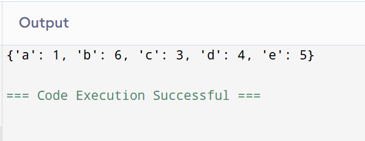

## Dictionary Operations in Python: Merging Two Dictionaries

## 🎯 Aim
To write a Python program that merges **two dictionaries** and combines their key-value pairs.

## 🧠 Algorithm
1. Define two dictionaries `dict1` and `dict2` with some key-value pairs.
2. Define a function `merge()` that merges the two dictionaries using the `**` unpacking operator.
   - The merged result will combine keys from both dictionaries. If a key exists in both, the value from `dict2` will overwrite that from `dict1`.
3. Call the `merge()` function and print the merged dictionary.

## 🧾 Program

```
dict1 = {'a': 1, 'b': 2, 'c': 3}
dict2 = {'d': 4, 'e': 5, 'b': 6}
def merge():
    return {**dict1, **dict2}
print(merge())
```

## Output


## Result
Thus the program has been executed successfully.
