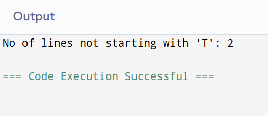

# File Handling in Python: Count Lines Not Starting with 'T'

## 🎯 Aim
To write a Python program that counts the number of lines in a text file `story.txt` that do **not** start with the alphabet `'T'`.

## 🧠 Algorithm
1. Open the file `story.txt` in **read mode**.
2. Initialize a counter `count` to zero.
3. Iterate through each line of the file:
   - Check if the first character of the line is **not** `'T'`.
   - If the line does not start with `'T'`, increment the `count` by 1.
4. After processing all lines, print the `count` value, which represents the number of lines that do not start with `'T'`.

## 🧾 Program

```
story.txt
This is Ram
I have read a book
It's a Sci-fi story

main.py
with open('story.txt', 'r') as file:
    count = 0
    for line in file:
        if line[0] != 'T':
            count += 1
    print("No of lines not starting with 'T':",count)
```

## Output


## Result
Thus the program has been executed successfully.